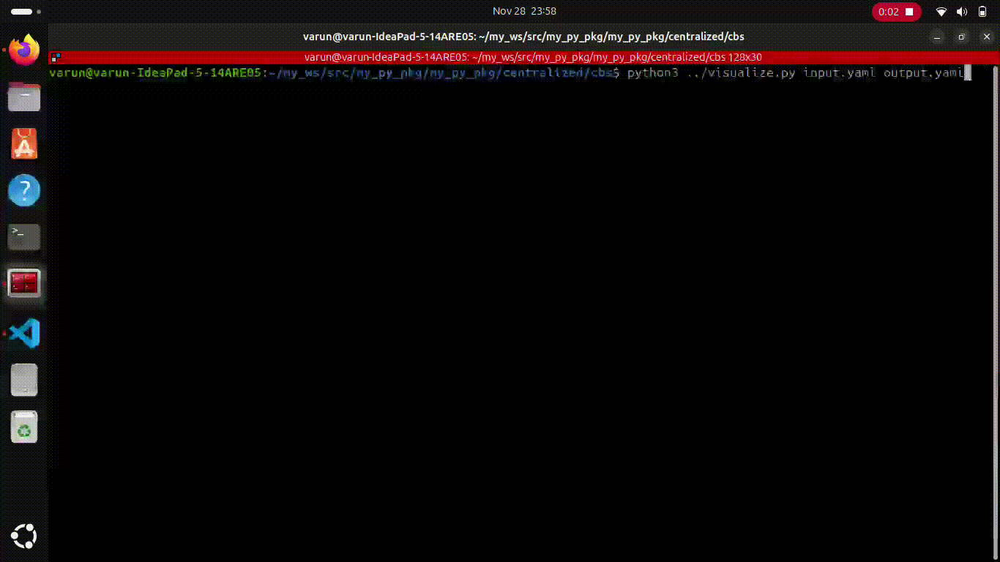
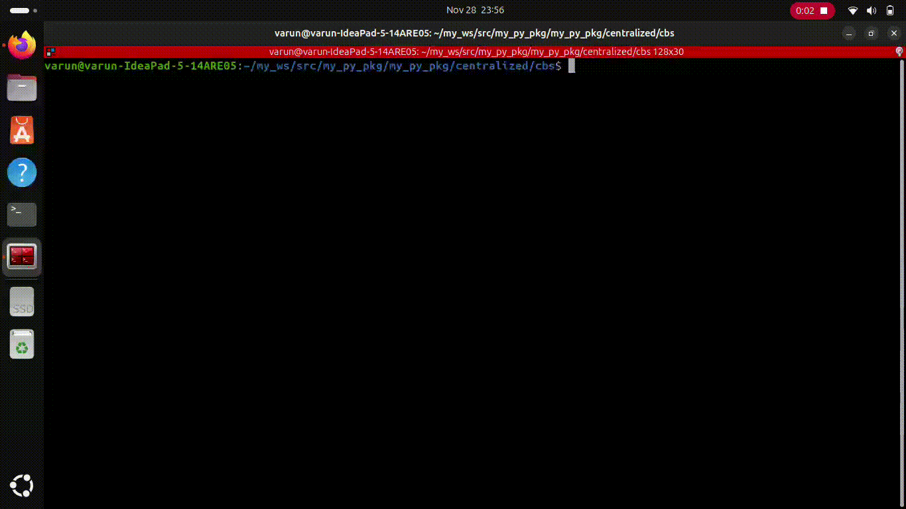

# Pathfinding Algorithm Visualizer

## A* algorithm 

A* is a widely used pathfinding algorithm in computer science and is particularly efficient in finding the shortest path between nodes on a weighted graph.
### Project Overview

This project was developed to implement the A* pathfinding algorithm as part of a larger effort in autonomous navigation for robots. The A* algorithm plays a crucial role in determining the optimal path for a robot to navigate from one point to another while avoiding obstacles.
### Getting Started

To run the A* pathfinding algorithm visualizer, ensure you have Python installed on your system. Additionally, you need to have Pygame installed. You can install Pygame using pip:

```
pip install pygame
```

After installing Pygame, you can clone this repository using the following command:
git clone https://github.com/Varun-Ajith/path-planning.git

Navigate to the cloned directory: 
```
cd path-planning
```
Run the Python script: 
```
python Path_planning.py
```

### Instructions
- Left-click on any empty grid square to place the starting node.
- Left-click on another empty grid square to place the ending node.
- Left-click and drag to create barriers.
- Right-click on a placed node to remove it.
- Press the Spacebar to start the A* algorithm visualization.
- Press 'c' to clear the grid and reset.


## Conflict-Based Search (CBS) Pathfinding Algorithm

This pathfinding algorithm implements a **Conflict-Based Search (CBS)** algorithm for multi-agent pathfinding, along with a low-level A* search. The implementation includes features such as conflict resolution, admissible heuristics, and support for vertex and edge constraints.

### Features

- **A* Search**: A low-level pathfinding algorithm that efficiently finds the shortest path for each agent.
- **CBS Algorithm**: A high-level conflict resolution algorithm that ensures paths for multiple agents are collision-free.
- **Dynamic Constraints**: Supports vertex and edge constraints for flexible pathfinding.
- **Custom Environment**: A grid-based environment where agents navigate around obstacles to reach their goals.

### How It Works

1. **Environment Setup**:
   - Define the grid dimensions, agents' start and goal positions, and obstacles.
   - The environment handles constraints and validates states and transitions.

2. **Low-Level Search**:
   - The `AStar` class is used for finding the shortest path for an individual agent within the constraints.

3. **Conflict Resolution**:
   - The `CBS` algorithm resolves conflicts between agents (vertex or edge conflicts) by dynamically adding constraints and re-computing paths.

4. **Output**:
   - The algorithm generates a collision-free path for each agent and computes the total cost.

### Key Classes

#### `AStar`
Implements the A* search algorithm:
- **Methods**:
  - `search(agent_name)`: Finds the shortest path for a given agent.
  - `reconstruct_path(came_from, current)`: Reconstructs the path from the start to the goal.

#### `CBS`
Implements the CBS algorithm:
- **Methods**:
  - `search()`: Resolves conflicts and generates collision-free paths for all agents.
  - `generate_plan(solution)`: Converts the solution into a readable plan.

#### `Environment`
Handles the grid, agents, and constraints:
- **Methods**:
  - `get_neighbors(state)`: Returns valid neighboring states for a given state.
  - `create_constraints_from_conflict(conflict)`: Generates constraints based on detected conflicts.

### Installation
1. Clone the repository:
```
git clone https://github.com/Varun-Ajith/path-planning.git
cd centralized/cbs
```
2. Then run the following command on terminal:
```
python3 cbs.py input.yaml output.yaml
```
3. To visualize the generated result:
```
 python3 ../visualize.py input.yaml output.yaml
```

### Requirements
- Python 3.x: This code is designed to run on Python 3. Make sure you have Python 3 installed.





## License
This project is licensed under the MIT License - see the [LICENSE](LICENSE) file for details.

## Acknowledgments
Special thanks to the developers of Pygame and matplotlib for providing a simple and intuitive framework for creating games and simulations in Python.
Feel free to contribute to this project by forking and submitting a pull request! If you encounter any issues or have suggestions for improvement, please open an issue.
