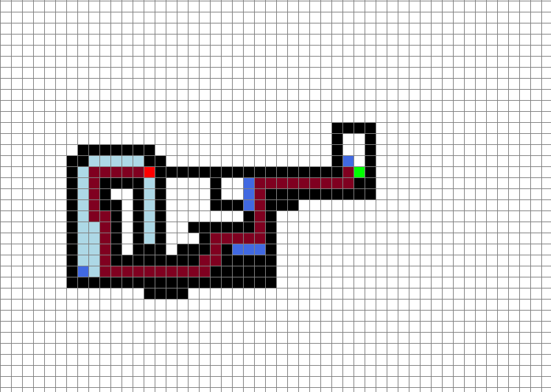

# A* Pathfinding Algorithm Visualizer

This repository contains a Python implementation of the A* pathfinding algorithm visualizer using Pygame. A* is a widely used pathfinding algorithm in computer science and is particularly efficient in finding the shortest path between nodes on a weighted graph.
## Project Overview

This project was developed to implement the A* pathfinding algorithm as part of a larger effort in autonomous navigation for robots. The A* algorithm plays a crucial role in determining the optimal path for a robot to navigate from one point to another while avoiding obstacles.
## Getting Started

To run the A* pathfinding algorithm visualizer, ensure you have Python installed on your system. Additionally, you need to have Pygame installed. You can install Pygame using pip:

```
pip install pygame
```

After installing Pygame, you can clone this repository using the following command:
git clone https://github.com/Varun-Ajith/path-planning.git

Navigate to the cloned directory:

`cd path-planning`
Run the Python script:
`python Path_planning.py`

## Instructions
Left-click on any empty grid square to place the starting node.
Left-click on another empty grid square to place the ending node.
Left-click and drag to create barriers.
Right-click on a placed node to remove it.
Press the Spacebar to start the A* algorithm visualization.
Press 'c' to clear the grid and reset.
##Screenshots


Credits
This project was developed by Varun Ajith.

##Acknowledgments
This project is inspired by the concepts of pathfinding algorithms and the visualization provided by Pygame.
Special thanks to the developers of Pygame for providing a simple and intuitive framework for creating games and simulations in Python.
Feel free to contribute to this project by forking and submitting a pull request! If you encounter any issues or have suggestions for improvement, please open an issue.
